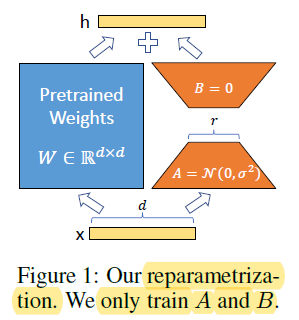

# Low-Rank Adaptation of Large Language Models

This repository demonstrates Intuition behind [LORA](https://arxiv.org/abs/2106.09685)
. how to perform matrix factorization using PyTorch. Matrix factorization is a 
powerful technique used in above paper to reduce LLM model size. In short give us the full rank matrix in subspace 
without effecting much performance. Thanks to UAMR JAMIL for explaination https://www.youtube.com/watch?v=PXWYUTMt-AU

## Dependencies
- PyTorch
- NumPy

You can install them using pip:
```bash
pip install torch numpy
```

## Usage

To use this repository, simply execute the provided Python script. Here's how to get started:

```bash
python lora.py
```

## Description
In this script, we generate a rank-deficient matrix W and perform the following steps:

Generate a Rank-Deficient Matrix W: We create a random matrix W with a specific rank deficiency.

Evaluate the Rank of Matrix W: We calculate the rank of the matrix W using NumPy's linalg.matrix_rank function.

SVD Decomposition: We perform Singular Value Decomposition (SVD) on W to decompose it into three matrices: U, S, and V.

Rank-r Factorization: For rank-r factorization, we retain only the first r singular values and corresponding columns of U and V.

Compute Matrices B and A: We compute matrices B and A such that W ≈ BA, where B = U_r * S_r and A = V_r.

Matrix Multiplication: We apply matrix multiplication to compute y using the original W matrix and y' using the matrices resulting from the decomposition (B and A).

Comparison: We compare the outputs y and y' to validate the effectiveness of the matrix factorization.

### Results
The script provides the following results:

Rank of the Matrix W
Shapes of Matrices B and A
Original y computed using W
y' computed using B and A
>Total parameters of W, B, and A
